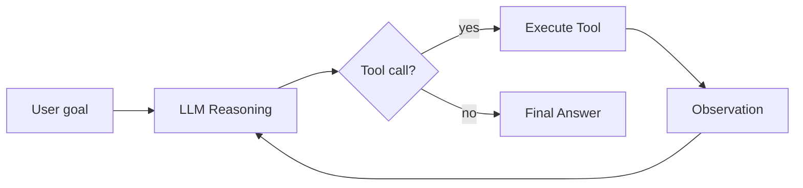

# Unit 1 — Agent Fundamentals

## Overview

Unit 1 builds the conceptual foundation needed to understand AI agents:

- **What is an agent?** The agent loop, environment, and goals
- **LLMs as the reasoning engine** — model families and special tokens
- **Tools** — how agents take actions in the world
- **The ReAct pattern** — Thought → Action → Observation

## Sections

- [What is an Agent?](what-is-an-agent.md)
- [LLMs & the Model Family](llms-and-models.md)
- [Tools & Actions](tools-and-actions.md)
- [Thoughts, Actions & Observations](thoughts-actions-observations.md)

## Key concepts at a glance

## Notebooks

| Notebook | Description | Open |
|----------|-------------|------|
| `notebooks/unit1/01_first_agent.ipynb` | Build your first agent from scratch |  |

## Notes

_Add your unit 1 notes here._
