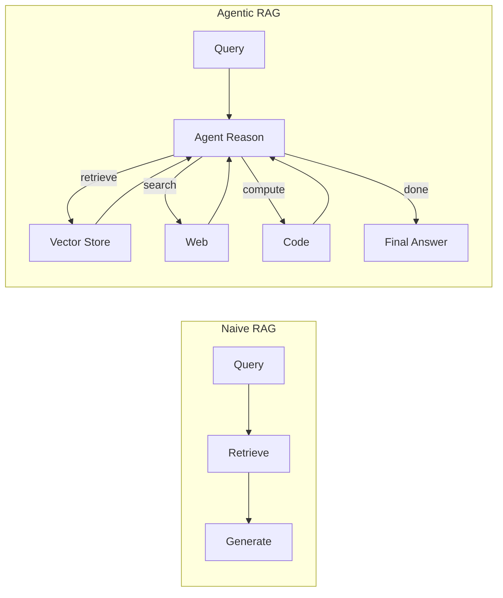

# Unit 3 — Agentic RAG

## Overview

**Agentic RAG** (Retrieval-Augmented Generation) goes beyond naive RAG pipelines by giving the agent control over *when* and *how* to retrieve information. Instead of always retrieving before generating, the agent decides:

- Whether retrieval is necessary at all
- Which knowledge source to query
- How many retrieval steps to perform
- Whether to re-rank, filter, or synthesize results

## Naive RAG vs. Agentic RAG

## Key techniques

| Technique | Description |
|-----------|-------------|
| **Router** | Classifies the query to select the right retriever |
| **Query rewriting** | Reformulates the query before retrieval |
| **Sub-question decomposition** | Breaks complex questions into simpler sub-queries |
| **Re-ranking** | Re-scores retrieved chunks before synthesis |
| **Iterative retrieval** | Retrieves multiple times, using each answer to guide the next query |

## Notebooks

| Notebook | Description |
|----------|-------------|
| `notebooks/unit3/01_basic_rag_agent.ipynb` | RAG tool inside a smolagents agent |
| `notebooks/unit3/02_multi_source_rag.ipynb` | Agent that queries multiple knowledge bases |

## Notes

_Add your unit 3 notes and experiments here._
