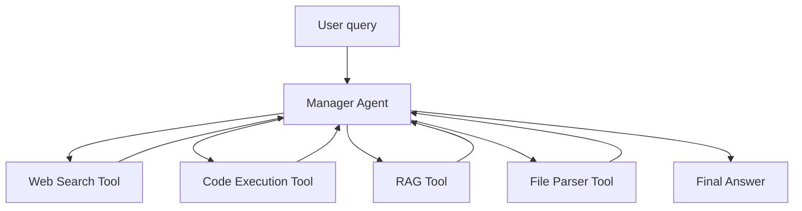

# Unit 4 — Capstone Project

## Overview

The capstone project brings together all concepts from the course. The goal is to build an agent that can be automatically evaluated on a leaderboard of tasks.

## Project goals

- [ ] Build an agent capable of answering diverse questions (text, code, web search, math)
- [ ] Integrate at least two different tool types
- [ ] Achieve a passing score on the GAIA benchmark subset used in the course
- [ ] Submit results to the public leaderboard

## GAIA Benchmark

[GAIA](https://huggingface.co/datasets/gaia-benchmark/GAIA) is a benchmark designed to test the real-world reasoning capabilities of AI agents. It requires:

- Multi-step reasoning
- Tool use (web search, code execution, file parsing)
- Common sense and factual knowledge

## Agent architecture (planned)



## Evaluation

```python
from smolagents import evaluate_agent

score = evaluate_agent(
    agent=my_agent,
    dataset="gaia-benchmark/GAIA",
    split="validation",
)
print(f"Score: {score:.1%}")
```

## Notes & results

_Add your capstone notes, intermediate results and leaderboard submissions here._
